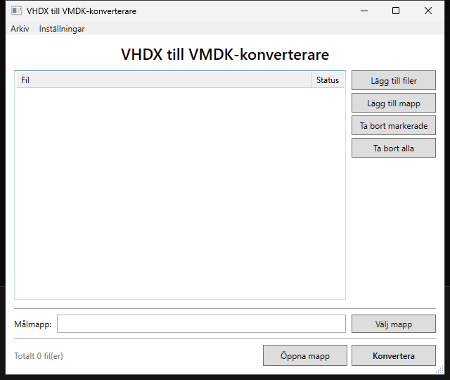
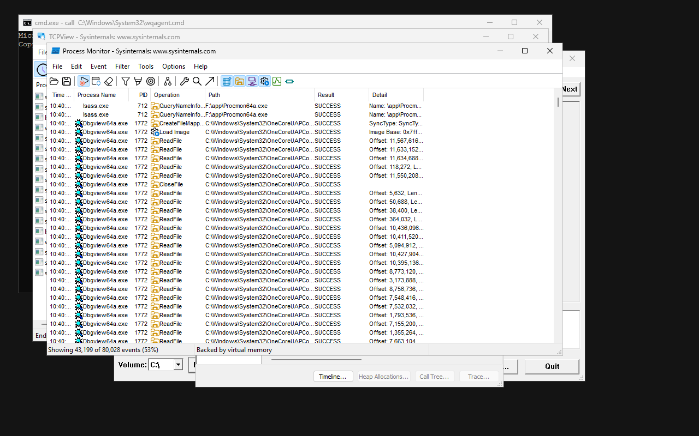

# WinQuick

> ### ⚠️ Under heavy development
>
> WinQuick is young and moving quickly. Commands, capabilities and measured
> numbers change between releases, and the hosts are not equally proven — see
> [Hosts](#hosts) for what has actually been verified on which machine. Try it,
> report what breaks, but do not build a production pipeline on it yet.

**Real Windows, on demand.**

WinQuick runs commands and desktop applications inside a real, disposable
Windows virtual machine, and manages its whole lifecycle for you. On the Apple
Silicon reference host a warm run completes in about 310 ms; other hosts differ,
and [Hosts](#hosts) says exactly how.

```console
$ winquick run -- cmd /c ver

Microsoft Windows [Version 10.0.26100.8972]
```

```console
brew install carlbomsdata/tap/winquick
winquick setup
```

A real Windows kernel under QEMU, on Apple's Hypervisor Framework, KVM or WHPX.
Not Wine, not an emulator, not a container. Every run starts from a pristine
image and leaves nothing behind.


| | |
|---|---|
| Windows command | **~310 ms** |
| PowerShell command | ~690 ms |
| `dotnet --version` | ~520 ms |
| Desktop session start | ~340 ms, then ~50 ms per UI read |

Medians on the reference host (Apple Silicon M4 Pro, macOS 26, QEMU 11.1), not
guaranteed latencies. Per-run cost differs by host; see [Hosts](#hosts).

## Running Windows programs

Console programs run directly. Anything that does not need a graphics stack —
a system tool, a vendor CLI you only have as a Windows binary, or an executable
you just built — runs with no wrapper and returns its own exit code.

```console
$ winquick run -- ipconfig /all

Windows IP Configuration
   Host Name . . . . . . . . . . . . : minwinpc
```

```console
winquick run -w . -a "publish/**" -- dotnet publish -c Release -o publish
winquick run -w ./winquick-artifacts -- 'publish\MyTool.exe' alpha beta
```

Exit codes come back untouched, so `&&`, `||` and CI logic behave as they would
on a Windows box: a program returning 2 makes `winquick run` exit 2.

**Programs with a window need the desktop capability.** The base runtime has no
graphics stack at all, so launching a GUI executable through `winquick run`
fails with a missing-DLL error rather than doing nothing useful. Install the
capability once, start a session, and GUI programs run and can be driven:

```console
winquick capability install desktop      # once, about a minute

winquick start --app ./tools
winquick desktop launch 'app\vhdx2vmdk.exe'
winquick desktop wait-window --title "VHDX"
winquick desktop screenshot tool.png
```



That is a self-contained **x64** WPF application, downloaded as a release
binary, running on the **ARM64** guest under Windows' own emulation. Windows
Notepad and Task Manager launch and drive the same way.

### What runs, and what does not

Tested rather than assumed, on the ARM64 guest:

| | Result |
|---|---|
| Console programs via `winquick run` | 21 of 26 Sysinternals command-line tools ran clean; the rest returned their own status codes, not errors |
| GUI programs in a desktop session | Notepad, Task Manager, Process Monitor, TCPView, VMMap, RamMap, DiskView all open and can be driven |
| x64 binaries on the ARM64 guest | Run under Windows' own emulation — including a self-contained x64 WPF application |
| Kernel-driver tools | Process Monitor loaded its driver and captured live kernel events |
| GUI programs via `winquick run` | **Fail.** The base runtime has no graphics stack; use a desktop session |
| Tools needing an absent Windows service | **Fail.** See below |



The guest is Microsoft's Validation OS — a deliberately minimal Windows. It has
the kernel, registry, shell and, with the desktop capability, the GUI stack. It
does not carry every service a desktop installation has, and a tool that needs
a missing one will not work.

Sysinternals' `disk2vhd` is the clear example: it needs the Volume Shadow Copy
service to snapshot a live volume, and `vssvc.exe` is not on Microsoft's media
at all, so there is no package to add. It starts and exits without a window.

`winquick run -- sc query <name>` answers the question for any tool in a
second, and running it under `winquick run` will show you the loader error if a
DLL is missing.

## What else you would use it for

The usual alternative is keeping a Windows VM alive — tens of gigabytes,
minutes of boot, snapshots that rot — or pushing to CI and waiting. Both are
too heavy for a single test run, and far too heavy for an agent doing it fifty
times an hour.

**Run your test suite on Windows, from a Mac.** The current directory appears
inside Windows as `C:\workspace` and becomes the working directory. It is
copied in and never copied back, so a build cannot touch your source.

```console
winquick capability install dotnet-sdk
winquick cache sync                     # restore packages on the host, once
winquick run -w . -- dotnet test
```

WinQuick can build projects targeting .NET Framework 2.0 through 4.8.1,
netstandard, and net6.0 through net10.0, including classic non-SDK projects,
with no Visual Studio anywhere. Running a .NET Framework binary additionally
needs `winquick capability install dotnet-framework`;
[docs/dotnet.md](docs/dotnet.md) records what has and has not been measured.

**Retrieve build output.** Artifacts are collected even when the command fails,
because a failed build's logs are usually the point. Patterns are relative to
the workspace: `**` recurses, a single `*` does not. A pattern that would
escape the workspace is refused before the run starts.

```console
winquick run -w . -a "bin/Release/**" -- dotnet publish -c Release
```

**Give a coding agent a way to check its own Windows work.** WinQuick is an
ordinary CLI, so agents, scripts and self-hosted CI use it identically. One
line in a project's README is enough:

```
Windows commands can be run locally with:  winquick run -- <command>
```

It is also a native [MCP](https://modelcontextprotocol.io) server, which gives
an agent structured tools instead of shell syntax:

```console
claude mcp add winquick -- winquick mcp
```

## Windows GUI testing

This is the part that is hard to get any other way. WinQuick can build a WPF or
WinForms application, run it in a real Windows desktop, and drive it through
Microsoft UI Automation — the same interface Windows' own accessibility tools
use. Nothing appears on your screen: no QEMU window, no RDP, no VNC.


That screenshot is the guest's own framebuffer, captured after a script typed
into the text box, chose from the combo box, ticked the checkbox and pressed
Save. The application never ran on the host.

```console
winquick capability install desktop      # once, about a minute

winquick start --app ./publish
winquick desktop launch 'app\MyApp.exe'
winquick desktop wait-window --title "Device Configuration"
winquick desktop screenshot before.png

winquick desktop type   --automation-id DeviceNameBox --text "PLC-01"
winquick desktop select --automation-id ModeCombo --item Diagnostic
winquick desktop toggle --automation-id LoggingCheck --state on
winquick desktop click  --automation-id SaveButton
winquick desktop get    --automation-id StatusText

winquick desktop screenshot after.png
winquick stop
```

Controls are addressed by `AutomationId`, so tests do not depend on pixel
positions or window layout. A selector matching more than one element is an
error that lists the candidates rather than a guess. A session starts in about
340 ms and stays up, so a step after that is a round trip rather than a boot:
reading an element takes about 50 ms, while `click` and `type` add a settle
wait and take about 300 ms.

The same sequence runs unattended as a script, which is the form worth putting
in CI:

```console
winquick ui-test MyApp.csproj --script smoke.uitest --out ./shots
```

```
launch app\MyApp.exe
wait-window --title "Device Configuration"
expect --automation-id SaveButton --expect-enabled false
type   --automation-id DeviceNameBox --text "PLC-01"
click  --automation-id SaveButton
expect --automation-id StatusText --expect-name "Saved: PLC-01"
screenshot after.png
```

`ui-test` builds the project inside Windows first, so no .NET SDK is needed on
the host, and it exits non-zero if any `expect` fails. The screenshots it
writes are ordinary PNGs you can attach to a build.

There is a complete worked example in
[examples/WpfDemo](examples/WpfDemo/) — a real application, a fourteen-step
script and the screenshots it produces. [docs/desktop.md](docs/desktop.md)
covers every verb.

## Proof

Every image here comes from a real run, reproduced by
[`scripts/capture-screenshots.sh`](scripts/capture-screenshots.sh). The
terminal images are typeset from output WinQuick actually printed during the
capture; the Windows images are the guest's own framebuffer. Nothing is a
mock-up.

| Your project goes in, and stays untouched | The guest has no network adapter |
|---|---|
|  |  |

## Requirements

Hardware virtualisation, 8 GiB of free disk, and Microsoft's Validation OS
image, which you obtain from Microsoft under their licence.

The disk figure is what `winquick doctor` checks for. A working installation is
roughly 1.4 GiB before any capabilities, and each capability adds its own;
[What you get](#what-you-get) breaks both down.

| | macOS | Linux | Windows |
|---|---|---|---|
| CPU | Apple Silicon (M1 or newer) | x86_64 or arm64 | x86_64 |
| OS | macOS 13 or later | any with KVM | Windows 10/11 |
| Accelerator | Hypervisor Framework | KVM | Windows Hypervisor Platform |
| QEMU | 11 or newer | 11 or newer | 11 or newer |
| Also needs | hivex | `libhivex-bin`, `ovmf` | nothing further |

Three things commonly cause trouble, and `winquick doctor` reports all of them:
a QEMU older than 11, which cannot migrate the guest's boot device and so makes
every run cold; `/dev/kvm` not being writable by you; and running WinQuick
inside a virtual machine, which cannot give Windows the hardware virtualisation
it needs. [docs/troubleshooting.md](docs/troubleshooting.md) has the fix for
each.

It does not use libvirt, and runs no daemon on any host.

## Install

Archives for every host are on the
[latest release](https://github.com/carlbomsdata/winquick/releases/latest).

**macOS**

```console
brew install carlbomsdata/tap/winquick
```

Homebrew installs the binary, the `ntfscp`/`ntfscat` helpers and the guest
bridge sources, and pulls in QEMU and hivex. Nothing is quarantined, so no
`xattr` step is needed. To install the archive by hand instead, see
[docs/install.md](docs/install.md), which covers the Gatekeeper step.

**Linux** — take the archive matching `uname -m`.

```console
sudo apt install qemu-system-x86 qemu-utils ovmf libhivex-bin
tar -xzf winquick-0.4.1-linux-x86_64.tar.gz
sudo cp -R winquick-0.4.1-linux-x86_64/* /usr/local/
```

On arm64, `qemu-system-arm` replaces `qemu-system-x86` and `qemu-efi-aarch64`
replaces `ovmf`.

**Windows** — install QEMU 11 or newer on `PATH`, then unpack the archive and
put that folder on `PATH` as well. It is one flat directory: `winquick.exe`
with its helpers beside it, so nothing further is required.

```console
tar -xf winquick-0.4.1-windows-x86_64.zip
```

**Then, on any host**, install the Windows runtime. Microsoft distributes the
Validation OS image under its own licence, so WinQuick cannot ship it:

```console
winquick setup --accept-microsoft-terms     # download it (about 2.4 GB)
winquick setup --from ~/Downloads/vos.iso   # or use a file you have
```

Setup finishes by booting Windows and running a real command, so it reports
success only when the runtime works. It takes about a minute.

## Hosts

| Host | Accelerator | Guest | Per-run cost | Verified |
|---|---|---|---|---|
| Apple Silicon macOS 13+ | HVF | Windows ARM64 | **~310 ms** | fully; the reference host |
| Windows x86_64 | WHPX | Windows x64 | ~17 s | fully, on Windows 11 26200 |
| Linux x86_64 / arm64 | KVM | matches the host | not measured | build, tests and diagnostics |
| Windows ARM64, Intel Mac | — | — | — | not planned |

macOS is the reference host and the source of the figures above: 100
consecutive runs of `cmd /c ver` measured p50 310 ms, p95 317 ms, p99 319 ms,
no failures.

**Windows boots the guest from scratch on every run, by design.** A resumed
WHPX guest runs correctly until something waits on a timer, and then waits far
longer than asked — measured at 212 s for `ping -n 4` against 20 s cold.
Builds, tests and PowerShell wait constantly, so Windows takes the predictable
option. `winquick run --warm` requests the prepared guest for commands known
not to wait, and needs a QEMU carrying `patches/whpx-stop-and-copy.patch`. The
cause is a Hyper-V synthetic-timer property of the platform, not a defect;
[docs/whpx-resume.md](docs/whpx-resume.md) has the evidence and
[docs/windows-host.md](docs/windows-host.md) the Windows detail.

**On Linux the host side is verified and the guest is not.** The binary compiles,
the test suite passes and `winquick doctor` reports the host correctly. A guest
has not been booted on real Linux hardware, because the only Linux machine
available was itself a virtual machine. Nothing measured argues against it; see
[docs/research.md](docs/research.md).

## What you get

| | |
|---|---|
| Windows | Microsoft Validation OS 10.0.26100 — ARM64 on Apple Silicon, x64 elsewhere |
| Windows guest image | 763 MiB |
| Prepared state, added by the first run | ~600 MiB |
| `dotnet test` on a small project | ~10 s |

Optional capabilities, installed only on request:

| | Size on disk |
|---|---|
| `powershell` — PowerShell 7.6.5 | 273 MiB |
| `dotnet-runtime` — .NET 10 runtime | 90 MiB |
| `dotnet-sdk` — .NET 10 SDK | 837 MiB |
| `dotnet-framework` — .NET Framework and classic MSBuild | 2.0 GiB image |
| `desktop` — WPF/WinForms, UI automation, screenshots | 3.0 GiB image |

The first three are volumes attached to the guest. The last two are serviced
into a copy of the Windows image, so they are whole images; the pristine
runtime is never written to either way.

## Behaviour worth knowing

Every run is clean. Files, registry keys and environment variables written by
one run are gone in the next, and the Windows image itself is never modified.
That is what makes it reasonable to hand to an automated agent: the worst a bad
run can do is waste itself.

The guest has no network adapter, which removes a large source of run-to-run
variability. Being offline is not by itself a security boundary, and
[docs/security.md](docs/security.md) is precise about what is; `winquick cache
sync` restores NuGet packages on the host so that builds still work.

The isolation is a real hardware hypervisor boundary — the guest is a separate
operating system on separate virtual hardware — but WinQuick is not a hardened
malware sandbox and has not been audited as one. It is built for running your
own builds and tests, not for detonating hostile samples.

Each run executes one command, though that command may do as much as you like:
`cmd /c` with operators, a script, or `dotnet test` across a solution. What
does not exist is an interactive shell, and a desktop session is the
long-lived alternative. Output comes back byte-exact when the command
finishes rather than streaming as it is produced, for the reasons set out in
[docs/architecture.md](docs/architecture.md).

## Commands

```
winquick setup                          install Windows (once)
winquick run -- <command>               run something
winquick start|stop|status              a Windows session that stays up
winquick desktop <verb>                 drive the session's desktop
winquick ui-test <project>              build a GUI app and test its UI
winquick capability list|install|remove optional tools inside Windows
winquick cache sync|info|clear          offline packages for dotnet
winquick doctor [--smoke]               check the installation
winquick info                           what is installed
winquick reset                          rebuild the prepared guest
winquick clean [--all]                  remove generated data
```

`winquick --help` and `winquick <command> --help` include examples.

## Documentation

- [docs/install.md](docs/install.md) — installing and updating
- [docs/architecture.md](docs/architecture.md) — how it works
- [docs/desktop.md](docs/desktop.md) — the desktop capability and UI automation
- [docs/mcp.md](docs/mcp.md) — the MCP server
- [docs/dotnet.md](docs/dotnet.md) — which .NET targets WinQuick can build
- [docs/security.md](docs/security.md) — the isolation model
- [docs/licensing.md](docs/licensing.md) — what may be redistributed
- [docs/troubleshooting.md](docs/troubleshooting.md) — when something breaks
- [docs/research.md](docs/research.md) — measurements and findings
- [THIRD_PARTY_NOTICES.md](THIRD_PARTY_NOTICES.md)

## Licence

WinQuick is Apache-2.0, © Carlboms Data AB. It uses QEMU, ntfsprogs and hivex
as separate programs and ships no Microsoft software. See
[docs/licensing.md](docs/licensing.md).
