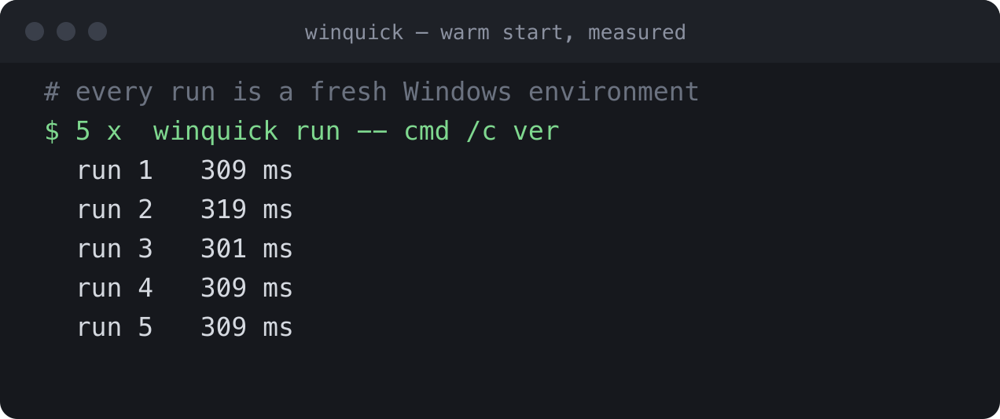
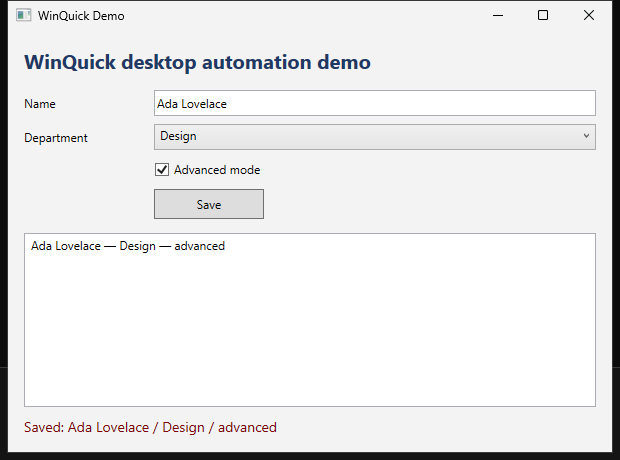
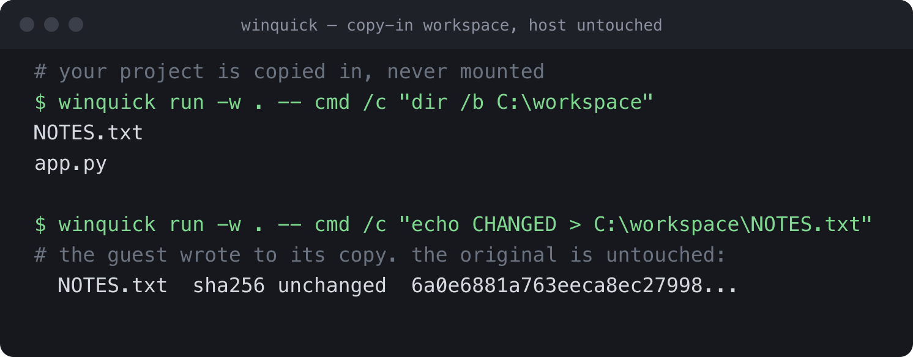
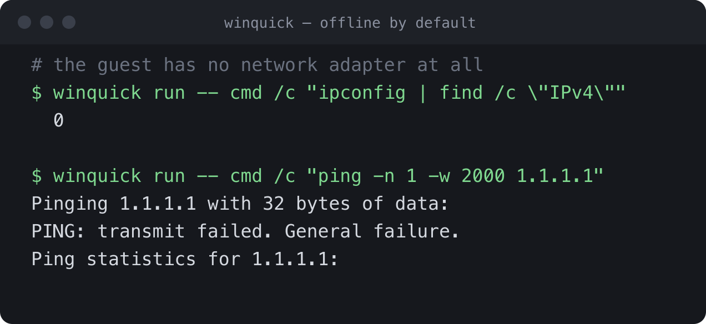

# WinQuick

**Instant disposable Windows environments.**

Run a real Windows command from macOS, Linux or Windows in a clean Windows
that is thrown away afterwards — in rather under a third of a second on the
reference host.

```console
$ winquick run -- cmd /c ver

Microsoft Windows [Version 10.0.26100.8972]
```



A real Windows kernel under QEMU, on Apple's Hypervisor Framework or on KVM.
Not Wine, not an emulator, not a container. Every run starts from a pristine
image and leaves nothing behind.

| | |
|---|---|
| Windows command | **~280 ms** |
| PowerShell command | ~650 ms |
| Desktop session start | **~350 ms** |
| UI automation step in a session | ~20 ms |
| Host | Apple Silicon macOS; Windows x86_64; Linux |

Times are medians observed on the reference host (Apple Silicon M4 Pro, macOS
26, QEMU 11.1), not guaranteed latencies. Windows hosts are much slower per
run and predictably so — see [which hosts this runs on](#which-hosts-this-runs-on).

```console
brew install carlbomsdata/tap/winquick
winquick setup
```

## Why

Building or testing Windows software without a Windows box usually means
keeping a Windows VM alive: tens of gigabytes, minutes of boot, snapshots that
rot, a desktop to click through. That is far too heavy for "run the test suite
once" — and much too heavy for a coding agent that wants to do it fifty times
an hour.

WinQuick does the narrow thing that matters for builds, tests and automation: run
one command inside a genuine Windows environment, get the exact output and exit
code back, throw the environment away.

The mental model is `docker run --rm`, with a real Windows kernel on the other
end.

## Requirements

Every host needs hardware virtualisation, about 4 GB of disk for the Windows
runtime, and Microsoft's Validation OS image, which you obtain from Microsoft
under their licence.

| | macOS | Linux | Windows |
|---|---|---|---|
| CPU | Apple Silicon (M1 or newer) | x86_64 or arm64 | x86_64 |
| OS | macOS 13 or later | any with KVM | Windows 10/11 |
| Accelerator | Hypervisor Framework | KVM, `/dev/kvm` readable and writable | Windows Hypervisor Platform |
| QEMU | 11 or newer | **11 or newer** | 11 or newer |
| Also needs | hivex | `libhivex-bin`, `ovmf` | nothing extra |

Three things catch people out. On Linux, Ubuntu 24.04 ships QEMU 8.2.2, which
cannot migrate the NVMe device the guest boots from, so every run would boot
cold; `winquick doctor` checks the version and says so. If `/dev/kvm` is not
writable by you, `sudo usermod -aG kvm $USER` and log in again.

On Windows the requirement is the **Windows Hypervisor Platform** feature, which
is not the same thing as installing the Hyper-V role.

**Run WinQuick on the machine itself, not inside a virtual machine.** Windows
needs real hardware virtualisation, and a nested hypervisor does not reliably
provide it: measured under Apple's Virtualization.framework, the Windows boot
manager faults in the guest firmware before Windows starts at all. WinQuick
reads the serial log and says so rather than looking like a hang.

WinQuick does not use libvirt and does not run a daemon on any host.

## Install

### macOS

```console
brew install carlbomsdata/tap/winquick
winquick setup
```

Homebrew installs the binary, the `ntfscat`/`ntfscp` helpers and the guest
bridge sources, and pulls in QEMU and hivex. Nothing is quarantined, so there is
no `xattr` step.

Or install the release archive by hand — see
[docs/install.md](docs/install.md), which also covers the Gatekeeper step a
browser download needs:

```console
tar -xzf winquick-0.4.0-darwin-arm64.tar.gz
sudo cp -R winquick-0.4.0-darwin-arm64/* /usr/local/
winquick setup
```

### Linux

Both architectures are supported. v0.4.0 publishes the `aarch64` archive; on
x86_64, build one with `./scripts/release-linux.sh 0.4.0`.

```console
sudo apt install qemu-system-x86 qemu-utils ovmf libhivex-bin
tar -xzf winquick-0.4.0-linux-aarch64.tar.gz
sudo cp -R winquick-0.4.0-linux-aarch64/* /usr/local/
winquick setup
```

On arm64, `qemu-system-arm` replaces `qemu-system-x86` and `qemu-efi-aarch64`
replaces `ovmf`.

Check your QEMU is 11 or newer first. If your distribution ships something
older, `winquick doctor` will tell you before you get as far as a slow run.

### Windows

Install QEMU 11 or newer and put it on `PATH`, then unpack the archive and put
the folder on `PATH` too:

```console
tar -xf winquick-0.4.0-windows-x86_64.zip
winquick setup
```

`winquick.exe` finds `ntfscp.exe`, `ntfscat.exe` and `hivexsh.exe` beside it, so
there is nothing else to install. Enable the Windows Hypervisor Platform feature
if it is off; `winquick doctor` checks.

Setup needs Microsoft's Windows validation runtime, which Microsoft distributes
under its own licence — WinQuick cannot ship it for you. It will offer to
download it, or take a file you already have:

```console
winquick setup --accept-microsoft-terms     # download it (about 2.4 GB)
winquick setup --from ~/Downloads/vos.iso   # use a file you already have
```

Setup finishes by booting Windows and running a real command, so it only says
"Ready" when it actually is. It takes about a minute.

### Which hosts this runs on

| Host | Accelerator | Guest | Per-run cost | Verified |
|---|---|---|---|---|
| Apple Silicon macOS 13+ | HVF | Windows ARM64 | **~280 ms** | fully; the reference host |
| Windows x86_64 | WHPX | Windows x64 | ~17 s | fully, on Windows 11 26200 |
| Linux x86_64 / arm64 | KVM | matches the host | not measured | build, tests and diagnostics only |

macOS is the host WinQuick is developed on and the one these numbers come from.
A prepared guest resumes into a fresh QEMU process and a command comes back in
rather under a third of a second: 100 consecutive `winquick run -- cmd /c ver`
measured p50 287 ms, p99 304 ms, zero failures.

**Windows boots cold on every run, deliberately.** A resumed WHPX guest runs
fine until something *waits*, and then it waits far longer than it was asked
to. Measured on Windows 11 26200 with a patched QEMU 11.1 and two processors,
against the same guest booted cold:

| command | resumed | cold |
|---|---|---|
| `cmd /c ver` | 2.0 s | 16.8 s |
| `cmd /c ping -n 4 127.0.0.1` | **212 s** | 20.2 s |

Eight times faster for a command that never sleeps, ten times slower for one
that does — and builds, tests and PowerShell sleep constantly. So Windows takes
the predictable half of that trade. `winquick run --warm` asks for the prepared
guest anyway, for a command you know does not wait; it needs a QEMU carrying
`patches/whpx-stop-and-copy.patch`.

The cause is that Windows parks idle processors on Hyper-V synthetic timers
whose expiry is absolute in the source partition's reference-time domain, and
public WHP exposes no way to read either partition's reference count and rebase
them. It is a property of the platform, not a bug waiting to be fixed;
[docs/whpx-resume.md](docs/whpx-resume.md) has the evidence and
[docs/windows-host.md](docs/windows-host.md) the Windows story in full.

**Linux is verified as far as the host side goes, and no further.** WinQuick
builds there, the full test suite passes, and `winquick doctor` reports the
host, its tools and its QEMU correctly — including refusing a QEMU too old to
migrate. What has not been verified is a guest actually booting, because the
only Linux machine available was itself a virtual machine, and Windows does not
boot under a nested hypervisor. Nothing measured argues against a Linux host on
real hardware; it simply has not been run there. The measurement is in
[docs/research.md](docs/research.md).

See [docs/install.md](docs/install.md) for details.

## Use it

**Run anything**

```console
winquick run -- cmd /c ver
winquick run -- cmd /c "echo A & echo B"
```

Arguments work like `docker run`: the program and its arguments are separate
words, and anything containing spaces stays one argument. stdout, stderr and the
exit code come back exactly as Windows produced them.

**PowerShell**

```console
winquick capability install powershell
winquick run -- pwsh -NoProfile -Command '$PSVersionTable'
```

**.NET**

```console
winquick capability install dotnet-sdk
cd MyProject
winquick cache sync                      # restore packages on the host, once
winquick run -w . -- dotnet test
```

`-w .` makes the current directory appear inside Windows as `C:\workspace` and
become the working directory. It is copied in and never copied back, so a build
cannot change your source.

WinQuick builds far more than the SDK's own version: .NET Framework 2.0 through
4.8.1, netstandard, and net6.0 through net10.0 — including a classic non-SDK
project. It will build an **x86 WinForms application targeting .NET Framework
4.0**, a Windows XP-era target, with no Visual Studio anywhere.

Running a .NET Framework binary is a second question, and the answer is
`winquick capability install dotnet-framework`: the runtime is on Microsoft's
own Validation OS media, and with it a classic `packages.config` WPF project
restores with its own `nuget.exe`, builds under Framework `MSBuild.exe` and
runs — measured on net472, including an x64 build executing under the ARM64
guest's emulation. [docs/dotnet.md](docs/dotnet.md) has the matrix and is
careful about what has and has not been measured.

**Get files back out**

```console
winquick run -w . -a "bin/Release/**" -- dotnet publish -c Release
```

Files land in `./winquick-artifacts/`. They are collected even when the command
fails — a failed build's logs are usually the point — and the exit code is passed
through untouched.

Patterns are relative to the workspace and matched inside Windows:

| Pattern | Matches |
|---|---|
| `bin/Release/**` | that directory, recursively, hierarchy preserved |
| `**/*.dll` | every `.dll` anywhere under the workspace |
| `bin/**/*.exe` | every `.exe` anywhere under `bin` |
| `logs/*.txt` | one directory only — a single `*` does not recurse |
| `foo?.txt` | `?` matches one character |
| `out/report.txt` | one named file or directory |

Slashes may lean either way. A pattern that tries to leave the workspace is
refused before the run starts.

**Windows desktop applications**

WinQuick can build a WPF or WinForms application, run it in a real Windows
desktop, show you what it looks like, and drive it. Nothing appears on your
screen: no QEMU window, no RDP, no VNC.

```console
winquick capability install desktop      # once, about a minute
```

Build it, launch it, look at it, work it:

```console
# Build for Windows and bring the output back
winquick run -w . -a "publish/**" -- dotnet publish -c Release -o publish

# Start a Windows desktop with that build available to it
winquick desktop start --app ./winquick-artifacts/publish
winquick desktop launch app\MyApp.exe
winquick desktop wait-window --title "Device Configuration"

# See it
winquick desktop screenshot before.png

# Inspect its controls
winquick desktop tree --title "Device Configuration"

# Work it
winquick desktop type   --automation-id DeviceNameBox --text "PLC-01"
winquick desktop select --automation-id ModeCombo --item Diagnostic
winquick desktop toggle --automation-id LoggingCheck --state on
winquick desktop click  --automation-id SaveButton
winquick desktop get    --automation-id StatusText

winquick desktop screenshot after.png
winquick desktop stop
```

A session starts in about 380 ms and stays up; each step after that takes tens
of milliseconds. It is not booting Windows that fast — it restores a Windows
that already booted. Preparing that saved state happens once, and takes about
20 seconds. Controls are addressed by `AutomationId`, and a selector matching
more than one element is an error listing the candidates rather than a guess.

Or put the whole thing in a script and run it in one command:

```console
winquick ui-test MyApp.csproj --script my.uitest --out ./shots
```

```
launch app\MyApp.exe
wait-window --title "Device Configuration"
expect --automation-id SaveButton --expect-enabled false
type --automation-id DeviceNameBox --text "PLC-01"
click --automation-id SaveButton
expect --automation-id StatusText --expect-name "Saved: PLC-01"
screenshot after.png
```

`ui-test` builds the project inside Windows first, so no .NET SDK is needed on
the host. See [docs/desktop.md](docs/desktop.md).

**Coding agents**

WinQuick is a normal CLI, so Claude Code, Codex, Cursor, shell scripts and CI all
use it the same way. One line in your project's README is enough:

```
Windows commands can be run locally with:  winquick run -- <command>
```

A fresh Claude Code session given that line diagnosed and fixed four Windows-only
bugs in a .NET project, verifying each fix against a real Windows kernel, without
knowing anything about how WinQuick works. See
[experiments/dogfood](experiments/dogfood/).

## See it

Every image here comes from a real run, reproduced by
[`scripts/capture-screenshots.sh`](scripts/capture-screenshots.sh).

**A real WPF application, driven through Windows UI Automation** — typed into,
selected, toggled and clicked, then verified:



| Your project goes in, and stays untouched | The guest has no network adapter |
|---|---|
|  |  |

## AI agents / MCP

WinQuick is also a native [MCP](https://modelcontextprotocol.io) server, so an
agent can use it through structured tools instead of shell syntax:

```console
claude mcp add winquick -- winquick mcp
```

That gives Claude Code thirteen tools: `windows_run` for disposable Windows
commands, builds and tests; `desktop_*` to start a real Windows desktop and
launch a WPF or WinForms application; `ui_tree`, `ui_get`, `ui_click` and
`ui_type` to inspect and drive it through Microsoft UI Automation; and
`ui_screenshot`, which returns a real PNG of the Windows screen in the response.

`mcp` is a mode of the same binary — no Node, no Python, no separate server —
and it calls the same internals the CLI does. See [docs/mcp.md](docs/mcp.md), and
[winquick-agent-skill](https://github.com/carlbomsdata/winquick-agent-skill) for
a skill that teaches an agent when to reach for Windows.

## What you get

| | |
|---|---|
| Windows | Microsoft Validation OS, build 10.0.26100 ARM64 |
| Runtime size | 763 MiB |
| Trivial command | ~280 ms |
| PowerShell command | ~650 ms |
| `dotnet --version` | ~450 ms |
| `dotnet test` on a small project | ~10 s |
| Desktop session start | ~350 ms, then ~20 ms per UI step |

Optional capabilities, installed only if you ask:

| | Size on disk |
|---|---|
| `powershell` — PowerShell 7.6.5 | 273 MiB |
| `dotnet-runtime` — .NET 10 runtime | 90 MiB |
| `dotnet-sdk` — .NET 10 SDK | 837 MiB |
| `dotnet-framework` — .NET Framework and the classic MSBuild toolchain | 2.0 GiB image |
| `desktop` — WPF/WinForms, UI automation, screenshots | 3.0 GiB image |

The first three are volumes attached to the guest. The last two are serviced
*into* a copy of the Windows image, so they are whole images rather than
additions — the pristine runtime is never written to either way.

## Every run is clean

Files, registry keys and environment variables written by one run are gone in the
next. The Windows image itself is never modified. That is what makes it safe to
hand to an automated agent that might do anything.

## Current scope

Measured on the development host: Apple Silicon, macOS 26, QEMU 11.1. Your
numbers will differ; the shape of them should not.

**Host support.** The table under
[which hosts this runs on](#which-hosts-this-runs-on) is the detail; this is the
summary.

| Host | Status |
|---|---|
| Apple Silicon macOS | Supported; the reference host |
| Windows x86_64 | Supported, cold runs only — much slower per run, and predictable |
| Linux x86_64 / arm64 | Host side verified; guest bring-up not yet run on real hardware |
| Windows ARM64 | Not planned yet |
| Intel Mac | Not planned |

On Windows, `winquick setup` and `winquick run` work today: a real x64
Validation OS guest, hardware-accelerated through the Windows Hypervisor
Platform, driven by the same agent and the same mailbox protocol macOS uses.
Nothing needs elevation, no disk image is ever mounted, and no exception is
asked of endpoint security software. What is still missing there —
architecture-specific capability payloads, extracting the VHDX from Microsoft's
ISO without mounting it, the desktop — is listed in
[docs/windows-host.md](docs/windows-host.md).

**Offline by default.** The guest has no network adapter unless you give it
one, and today you cannot: enabling it means servicing the base image the way
the desktop capability is serviced, which is not done yet. Being offline
removes a large source of run-to-run variability and keeps the default
environment disconnected from your network; it is not by itself a security
boundary — [docs/security.md](docs/security.md) is precise about what is.
`winquick cache sync` restores NuGet packages on the host so builds work
offline.

**Separate runtimes, on purpose.** The base runtime carries no graphics stack
at all, which is what keeps it at 763 MiB and a command at ~280 ms; it is for
commands, builds and tests. `dotnet-framework` adds .NET Framework and the
classic MSBuild toolchain to the image `run` boots; `desktop` adds WPF,
WinForms, UI Automation and screenshots on top of that. Each is a separate
install because most runs never need it, each is a *second* image so the
pristine one stays byte-identical, and removing one is deleting a directory.
`winquick doctor` says which image a run will boot; `winquick desktop start`
names anything still missing.

**Execution model.** Each `winquick run` starts one disposable top-level
process and throws the environment away afterwards. That process can do as much
as you like — `cmd /c` with operators, a PowerShell script, `dotnet test` over a
whole solution. What does not exist is a shell you type into over time; a
desktop session is the long-lived alternative, and stays up between commands.

**Output timing.** stdout and stderr are returned, separately and byte-exact,
when the command finishes rather than streaming as it is produced. The guest
has no live channel back to the host that does not need a driver or a compiled
helper in the guest; see [docs/architecture.md](docs/architecture.md).

**Filenames.** Workspace filenames may use any Unicode character in the basic
multilingual plane — Swedish, CJK, Cyrillic and Greek all transfer normally.
Characters above U+FFFF, which in practice means emoji, cannot be represented
on the FAT volume used to carry the workspace. WinQuick checks the whole tree
first and names every offending path rather than failing partway through.

## Commands

```
winquick setup                          install Windows (once)
winquick run -- <command>               run something
winquick start|stop|status              a Windows session that stays up
winquick capability list|install|remove optional tools inside Windows
winquick cache sync|info|clear          offline packages for dotnet
winquick desktop <verb>                 drive the session's desktop
winquick ui-test <project>              build a GUI app and test its UI
winquick doctor [--smoke]               check the installation
winquick info                           what is installed
winquick reset                          rebuild the prepared guest
winquick clean [--all]                  remove generated data
```

`winquick --help` and `winquick <command> --help` have examples.

## Documentation

- [docs/install.md](docs/install.md) — installing and updating
- [docs/architecture.md](docs/architecture.md) — how it works
- [docs/desktop.md](docs/desktop.md) — the desktop capability and UI automation
- [docs/mcp.md](docs/mcp.md) — the MCP server for AI agents
- [docs/dotnet.md](docs/dotnet.md) — which .NET targets WinQuick can build
- [docs/security.md](docs/security.md) — the isolation model, precisely
- [docs/licensing.md](docs/licensing.md) — what may be redistributed
- [docs/troubleshooting.md](docs/troubleshooting.md) — when something breaks
- [docs/research.md](docs/research.md) — measurements and findings
- [THIRD_PARTY_NOTICES.md](THIRD_PARTY_NOTICES.md)

## Licence

WinQuick is Apache-2.0, © Carlboms Data AB. It uses QEMU, ntfsprogs and hivex as
separate programs and ships no Microsoft software. See
[docs/licensing.md](docs/licensing.md).
